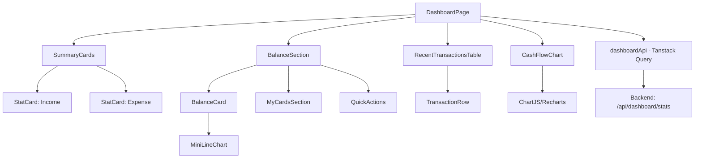

# Dashboard Redesign - Design

**Spec**: `.specs/features/dashboard-redesign/spec.md`
**Status**: Draft

---

## Architecture Overview

O redesign mantém a arquitetura existente (React + TypeScript + TailwindCSS) mas reorganiza componentes para seguir o novo layout visual. Abordagem component-first com composição clara e separação de concerns.

**Estratégia**: Refatorar componentes existentes gradualmente, reutilizando lógica de fetching e estado. Criar novos componentes apenas para elementos visuais únicos do novo design.



---

## Code Reuse Analysis

### Existing Components to Leverage

| Component | Location | How to Use |
|-----------|----------|-----------|
| `StatCard` | `frontend/src/features/dashboard/components/StatCard.tsx` | **Refatorar** - manter lógica de formatação de moeda e trends, redesenhar layout |
| `dashboardApi` | `frontend/src/features/dashboard/api/dashboardApi.ts` | **Reutilizar 100%** - fetching de dados já funcional |
| `useQuery (Tanstack)` | `DashboardPage.tsx` | **Manter** - gerenciamento de estado e cache |
| `AnalyticsChart` | `frontend/src/features/dashboard/components/AnalyticsChart.tsx` | **Substituir** - criar novo `CashFlowChart` com barras duplas |
| `RecentTransactions` | `frontend/src/features/dashboard/components/RecentTransactions.tsx` | **Refatorar para Tabela** - transformar de lista para table com ordenação |
| Formatação de moeda | Hooks/utils existentes | **Reutilizar** - `Intl.NumberFormat` já implementado |
| Icons (Lucide React) | Já em uso | **Expandir** - adicionar novos ícones (Send, Receive, Convert, etc) |

### Integration Points

| System | Integration Method |
|--------|-------------------|
| Backend Dashboard API | Mantém endpoint atual `/api/dashboard/stats` - response já tem dados necessários |
| Autenticação | Reutiliza guards existentes - sem mudanças |
| Roteamento | Mantém `/dashboard` route - componentes internos mudam |
| Estado Global (Zustand) | Usa stores existentes (authStore, transactionStore) |

---

## Components

### 1. DashboardPage (Refatorado)

- **Purpose**: Container principal que orquestra layout do novo design
- **Location**: `frontend/src/features/dashboard/pages/DashboardPage.tsx`
- **Interfaces**:
  - Recebe data de `useQuery(['dashboard-stats'])`
  - Distribui dados para componentes filhos via props
- **Dependencies**: dashboardApi, Tanstack Query
- **Changes from Current**:
  - Grid layout: 3 colunas (2 colunas principais + 1 sidebar direita)
  - Remove componentes antigos: `QuickActionCards`, `StockPortfolio`, `ActionSection`
  - Adiciona: `CashFlowChart`, `BalanceSection`, `MyCardsSection`, `RecentTransactionsTable`

**Estrutura de Layout**:
```tsx
<div className="grid grid-cols-12 gap-6">
  {/* Coluna Esquerda - 8 colunas */}
  <div className="col-span-8">
    <SummaryCards /> {/* Income + Expense */}
    <CashFlowChart />
    <RecentTransactionsTable />
  </div>
  
  {/* Coluna Direita - 4 colunas */}
  <div className="col-span-4">
    <BalanceCard />
    <MyCardsSection />
  </div>
</div>
```

---

### 2. SummaryCards (Novo - Composto)

- **Purpose**: Container para cards de Income e Expense lado a lado
- **Location**: `frontend/src/features/dashboard/components/SummaryCards.tsx`
- **Interfaces**:
  ```ts
  interface SummaryCardsProps {
    income: number;
    expense: number;
    incomeChange?: { value: number; isPositive: boolean };
    expenseChange?: { value: number; isPositive: boolean };
    incomeSubtext?: string; // "You made an extra $3,345.00 this month"
    expenseSubtext?: string; // "You overspent by $5256.00 this month"
  }
  ```
- **Dependencies**: Reutiliza `formatCurrency` utility
- **Reuses**: Lógica de trends do `StatCard` atual

---

### 3. StatCard (Refatorado)

- **Purpose**: Card individual de métrica (Income ou Expense)
- **Location**: `frontend/src/features/dashboard/components/StatCard.tsx` 
- **Changes**:
  - Simplificar: remover backgrounds gradientes complexos
  - Layout mais limpo: ícone dropdown no canto, valor principal centralizado
  - Adicionar: subtexto descritivo abaixo do valor
- **Interfaces**:
  ```ts
  interface StatCardProps {
    type: 'income' | 'expense';
    value: number;
    change?: { value: number; isPositive: boolean };
    subtext?: string;
    onMenuClick?: () => void;
  }
  ```

---

### 4. CashFlowChart (Novo)

- **Purpose**: Gráfico de barras duplas mostrando Cash In vs Cash Out mensalmente
- **Location**: `frontend/src/features/dashboard/components/CashFlowChart.tsx`
- **Library**: Recharts (já em `package.json`) ou Chart.js
- **Interfaces**:
  ```ts
  interface CashFlowChartProps {
    data: Array<{
      month: string; // "Jan", "Feb", etc
      cashIn: number;
      cashOut: number;
    }>;
    period: 'year' | 'custom';
    onPeriodChange?: (period: string) => void;
  }
  ```
- **Dependencies**: Recharts `BarChart`, `Bar`, `XAxis`, `YAxis`, `Tooltip`, `Legend`
- **Features**:
  - Hover tooltip mostrando valores exatos
  - Dropdown para selecionar período
  - Indicador visual para mês atual destacado
  - Cores: roxo para In, roxo claro/azul para Out

---

### 5. BalanceCard (Refatorado)

- **Purpose**: Card de "My Balance" com valor principal e mini gráfico de linha
- **Location**: `frontend/src/features/dashboard/components/BalanceCard.tsx`
- **Interfaces**:
  ```ts
  interface BalanceCardProps {
    balance: number;
    change?: { value: number; isPositive: boolean };
    chartData?: Array<{ date: string; value: number }>; // Últimos 7 dias
    subtext?: string; // "You made an extra $14,972.00 this months"
  }
  ```
- **Dependencies**: MiniLineChart (sub-component interno ou separado)
- **Reuses**: Lógica de formatação de moeda

---

### 6. MyCardsSection (Novo)

- **Purpose**: Seção "My Cards" com cartões visuais e botões de ação
- **Location**: `frontend/src/features/dashboard/components/MyCardsSection.tsx`
- **Interfaces**:
  ```ts
  interface Card {
    id: string;
    lastFourDigits: string;
    brand: 'VISA' | 'MASTERCARD' | 'AMEX';
    expiryDate?: string;
    holderName?: string;
  }
  
  interface MyCardsSectionProps {
    cards: Card[];
    onAddCard?: () => void;
  }
  ```
- **Components**:
  - `CreditCardVisual`: Componente visual do cartão (gradiente roxo, logo VISA)
  - `QuickActionButtons`: 4 botões circulares (Convert, Send, Receive, More)
- **Styling**: Cards com gradiente roxo similar ao design de referência

---

### 7. QuickActionButtons (Novo - Sub-component)

- **Purpose**: Botões de ação rápida abaixo dos cartões
- **Location**: Dentro de `MyCardsSection` ou separado em `components/QuickActionButtons.tsx`
- **Interfaces**:
  ```ts
  type ActionType = 'convert' | 'send' | 'receive' | 'more';
  
  interface QuickActionButtonsProps {
    onAction: (action: ActionType) => void;
  }
  ```
- **Icons**: Lucide React - `ArrowLeftRight`, `Send`, `Download`, `MoreHorizontal`

---

### 8. RecentTransactionsTable (Refatorado)

- **Purpose**: Tabela completa de transações com sorting, filtering, search
- **Location**: `frontend/src/features/dashboard/components/RecentTransactionsTable.tsx`
- **Interfaces**:
  ```ts
  interface Transaction {
    id: string;
    name: string;
    date: Date;
    amount: number;
    category: string;
    account: string;
    status: 'success' | 'pending' | 'failed';
  }
  
  interface RecentTransactionsTableProps {
    transactions: Transaction[];
    onSort?: (column: string, direction: 'asc' | 'desc') => void;
    onFilter?: (filters: FilterOptions) => void;
    onSearch?: (query: string) => void;
  }
  ```
- **Features**:
  - Sortable columns (click header to sort)
  - Search input com debounce
  - Filter button abrindo modal/dropdown
  - Status badges coloridos
  - Responsive: scroll horizontal em mobile
- **Reuses**: 
  - Dados de `stats.recentTransactions` do endpoint atual
  - Formatação de data com `date-fns`

---

### 9. Sidebar (Refatorado)

- **Purpose**: Navegação lateral minimalista com ícones
- **Location**: `frontend/src/components/layout/Sidebar.tsx`
- **Changes**:
  - Redesign visual: mais minimalista, ícones maiores
  - Logo no topo redesenhado
  - Itens de menu com ícones apenas (sem texto por padrão)
  - Estado ativo mais destacado
  - Bottom items: Settings, Theme toggle, User profile
- **Interfaces**: Mantém atual, muda apenas styling

---

## Data Models

### Dashboard Stats Response (Existing - No Changes)

```ts
interface DashboardStats {
  summary: {
    totalBalance: number;
    totalIncome: number;
    totalExpenses: number;
  };
  recentTransactions: Transaction[];
  // Adicionar se backend suportar:
  cashFlow?: Array<{
    month: string;
    cashIn: number;
    cashOut: number;
  }>;
  balanceHistory?: Array<{
    date: string;
    value: number;
  }>;
}
```

**Backend Changes Needed**:
- Adicionar campos `cashFlow` e `balanceHistory` no endpoint `/api/dashboard/stats`
- Se não disponível inicialmente: usar dados mock no frontend até backend implementar

### Card Model (New)

```ts
interface PaymentCard {
  id: string;
  lastFourDigits: string;
  brand: 'VISA' | 'MASTERCARD' | 'AMEX';
  expiryDate?: string;
  holderName: string;
  isDefault?: boolean;
}
```

**Backend**: Criar endpoint `/api/cards` se ainda não existe

---

## Styling Strategy

### Design Tokens (Update CSS Variables)

```css
:root {
  /* Primary Colors - Fireart Style */
  --color-primary: #6366f1; /* Indigo/Purple */
  --color-primary-light: #818cf8;
  --color-primary-dark: #4f46e5;
  
  /* Card Backgrounds */
  --color-card-income: #f0fdf4; /* Green tint */
  --color-card-expense: #fef2f2; /* Red tint */
  --color-card-default: #ffffff;
  
  /* Status Colors */
  --color-success: #10b981;
  --color-warning: #f59e0b;
  --color-error: #ef4444;
  
  /* Neutrals - Softer than current */
  --color-gray-50: #f9fafb;
  --color-gray-100: #f3f4f6;
  --color-gray-600: #4b5563;
  --color-gray-900: #111827;
  
  /* Spacing - More generous */
  --spacing-unit: 8px;
  --card-padding: 24px; /* 3 * spacing-unit */
  --grid-gap: 24px;
}
```

### TailwindCSS Custom Classes

```js
// tailwind.config.js additions
module.exports = {
  theme: {
    extend: {
      colors: {
        primary: {
          DEFAULT: '#6366f1',
          light: '#818cf8',
          dark: '#4f46e5',
        }
      },
      boxShadow: {
        'card': '0 1px 3px rgba(0,0,0,0.06)',
        'card-hover': '0 4px 12px rgba(0,0,0,0.08)',
      },
      borderRadius: {
        'card': '16px',
      }
    }
  }
}
```

---

## Component Hierarchy

```
DashboardPage
├── Grid Container (cols-12)
│   ├── Left Column (col-span-8)
│   │   ├── SummaryCards
│   │   │   ├── StatCard (Income)
│   │   │   └── StatCard (Expense)
│   │   ├── CashFlowChart
│   │   └── RecentTransactionsTable
│   │       ├── SearchInput
│   │       ├── FilterButton
│   │       └── TransactionRow (map)
│   │
│   └── Right Column (col-span-4)
│       ├── BalanceCard
│       │   └── MiniLineChart
│       └── MyCardsSection
│           ├── CreditCardVisual (map)
│           └── QuickActionButtons
│               ├── ActionButton (Convert)
│               ├── ActionButton (Send)
│               ├── ActionButton (Receive)
│               └── ActionButton (More)
```

---

## Implementation Strategy

### Phase 1: Foundation (P1 - MVP)
1. Refatorar `DashboardPage` layout (grid 12 colunas)
2. Criar `SummaryCards` + refatorar `StatCard`
3. Implementar `CashFlowChart` com dados mock
4. Criar `BalanceCard` básico (sem mini chart)
5. Criar `MyCardsSection` com cards visuais
6. Refatorar Sidebar para design minimalista

### Phase 2: Enhancement (P2)
7. Converter `RecentTransactions` para tabela completa
8. Adicionar sorting e filtering
9. Implementar MiniLineChart no BalanceCard
10. Adicionar tooltips interativos nos gráficos

### Phase 3: Polish (P3)
11. Animações e transições
12. Acessibilidade (keyboard nav, focus states)
13. Skeleton loaders
14. Error states e empty states

---

## Responsive Breakpoints

| Breakpoint | Layout Changes |
|------------|----------------|
| Mobile (<768px) | Stack vertical: Cards → Chart → Table. Sidebar collapses to hamburger |
| Tablet (768px-1024px) | Grid 2 colunas: Left (cards+chart) / Right (balance+cards). Table full width below |
| Desktop (>1024px) | Grid 3 colunas conforme design: 8-4 split |

---

## Testing Strategy

- **Unit Tests**: Componentes isolados (StatCard, BalanceCard) com React Testing Library
- **Integration Tests**: DashboardPage com dados mock
- **Visual Regression**: Chromatic ou Percy para screenshots comparativos
- **E2E**: Cypress - carregar dashboard, interagir com filtros, validar dados exibidos

---

## Migration Path

**Opção A: Big Bang (Recomendado para este caso)**
- Criar branch `feature/dashboard-redesign`
- Refatorar tudo de uma vez
- Deploy em staging para review completo
- Merge quando 100% funcional

**Opção B: Incremental (Se precisar de deploy gradual)**
- Feature flag `NEW_DASHBOARD_UI`
- Implementar componentes novos em paralelo
- Toggle entre old/new dashboard
- Remover flag após validação

**Escolha**: **Opção A** - redesign é coeso e funcionalmente equivalente, não faz sentido manter duas versões em produção.

---

## Performance Considerations

- **Code Splitting**: Lazy load gráficos pesados (Chart.js bundle)
- **Memoization**: `React.memo` em `TransactionRow` para evitar re-renders desnecessários na tabela
- **Virtualization**: Se tabela tiver >100 transações, usar `react-virtual` ou `react-window`
- **Image Optimization**: SVG para ícones, otimizar imagens de background dos cards
- **Data Fetching**: Manter cache do Tanstack Query, staleTime adequado

---

## Accessibility Checklist

- [ ] Todos os botões têm labels descritivos
- [ ] Focus states visíveis em todos elementos interativos
- [ ] Contraste mínimo WCAG AA (4.5:1 para texto)
- [ ] Imagens decorativas com `alt=""` ou `aria-hidden`
- [ ] Keyboard navigation funcional (Tab, Enter, Escape)
- [ ] Screen reader friendly: proper heading hierarchy (h1 → h2 → h3)
- [ ] Form inputs com labels associados
- [ ] Error messages anunciados para screen readers

---

## Dependencies to Install

```bash
# Se não estiverem no package.json:
npm install recharts
npm install @headlessui/react  # Para modals/dropdowns acessíveis
npm install clsx  # Para conditional classes mais limpo
```

---

## Open Questions

1. **Backend suporta `cashFlow` e `balanceHistory`?** 
   - Se não: Usar mock data temporariamente
   - Se sim: Documentar formato esperado do response

2. **Cards reais existem no DB?**
   - Se não: Criar tabela `cards` no Prisma schema
   - Se sim: Criar endpoint `/api/cards`

3. **Filtro avançado de transações - quais campos?**
   - Date range (obrigatório)
   - Category multiselect
   - Account multiselect
   - Amount range
   - Status

4. **Ações dos botões (Convert, Send, Receive) - onde levam?**
   - Placeholder: console.log ou toast "Feature coming soon"
   - Ou: Abrir modal com formulário (fora do escopo inicial)
